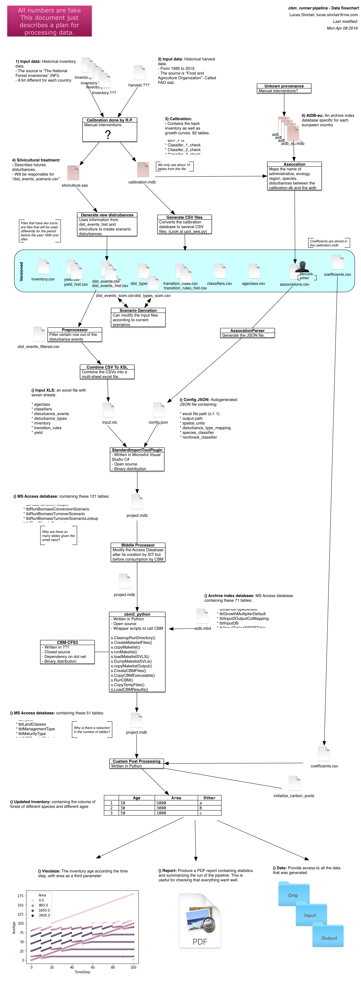
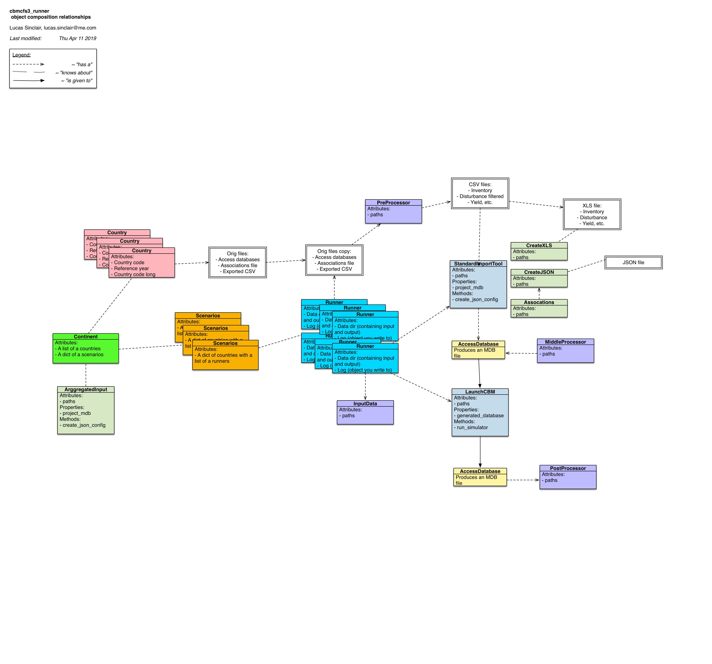

# `cbmcfs3_runner` version 0.4.2

`cbmcfs3_runner` is a python package for dealing with the automation and running of a complex series of models involving the European economy, the forest sector, carbon budgets and their interactions. Notably in relation to the CBM-CFS3 model developed by Canada.

## Warnings

This package is currently under heavy development and the master branch is subject to breaking changes at any moment. If you are interested in using this package in your own installation, please contact the authors.

## Installing

No automated installation has been developed for the `cbmcfs3_runner` package yet. In the meantime, following this document and typing these commands on your command-line interface should get you started. If you cannot get a functional installation set up, contact the authors.

#### Step 1: Cloning the repository

Here you will download a copy of the code from github and place it in your file system.

    $ cd /
    $ mkdir repos
    $ cd repos
    $ git clone git@github.com:xapple/cbmcfs3_runner.git

#### Step 2: Modify your python search path

Here you will edit your ``.bashrc`` or ``.bash_profile`` to add a reference to the python package you just downloaded. If you are on Windows, you can change your environment variables with the `setx` command.

    $ vim ~/.bash_profile
    export PYTHONPATH="/repos/cbmcfs3_runner/":$PYTHONPATH

When you type `import cbmcfs3_runner` python will know where to look.

#### Step 3: Install all required python packages

`cbmcfs3_runner` uses many third party python libraries. You can get them by running these commands:

    $ pip install --user autopaths
    $ pip install --user plumbing
    $ pip install --user pymarktex
    $ pip install --user pbs3

#### Step 4: Retrieve European forest data

Here you will download a copy of the dataset that describes the forest inventory of 26 EU member states along with their historical harvesting.

    $ cd /repos/
    $ git clone git@github.com:xapple/cbmcfs3_data.git

NB: Currently the access to that repository is restricted. Please contact the authors.

#### Step 5: Follow other specific instructions

Setting up the rest of the OS environment and installing the other required executables is covered in the `bioeconomy_notes` repository.

NB: Currently the access to that repository is restricted. Please contact the authors.

## Running the model

### Via an ipython session

To start an interactive session with the model on the command line, run:

    $ ipython3

At the ipython prompt, to import the continent object that gives access to simulations pertaining to the 26 countries, run:

    >>> from cbmcfs3_runner.core.continent import continent

For instance, you can now create a runner for the 'growth_only' scenario, the 'AT' country and the simulation period zero:

    >>> runner = continent[('growth_only', 'AT', 0)]

Finally to run that step of the model:

    >>> runner.run(verbose=True)

## Data Flowchart

Below is drawn the flowchart describing the data processing along all the steps of `cbmcfs3_runner`:

## Objects Diagram

Below is presented a tentative UML-style diagram detailing not the inheritance of the classes but the use of the composition design pattern between the objects created:

## Timeline representation

The simulation is broken down into several periods which are represented below.

