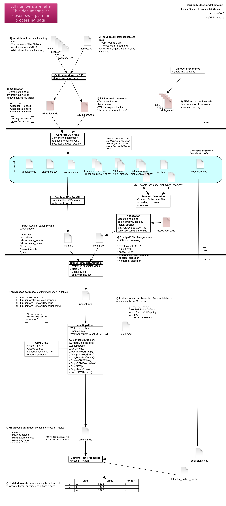
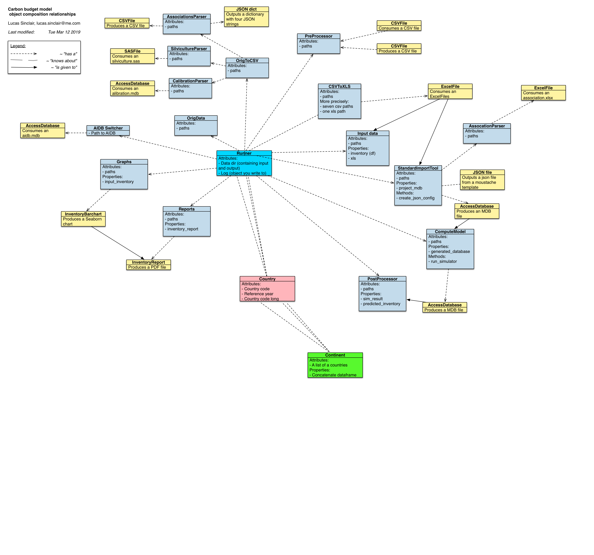

# `cbm_runner` version 0.2.0

Here, `cbm_runner` is a python package for dealing with the automation and running of a complex series of models involving the European economy, carbon budgets and their interactions. Notably in relation to the CBM-CFS3 model developed by Canada.

## Warnings

This package is currently under heavy development and the master branch is subject to breaking changes at each commit. If you are interested in using this package in your own installation, please contact the authors.

## Installing

No automated installation has been developed for the `cbm_runner` package yet. In the meantime, following this document and typing these commands on your command-line interface should get you started. If you cannot get a functional installation set up, contact the authors.

#### Step 1: Cloning the repository
Here you will download a copy of the code from github and place it in your file system.

    $ cd /
    $ mkdir repos
    $ cd repos
    $ git clone https://emsincllu@webgate.ec.europa.eu/CITnet/stash/scm/bioeconomy/cbm_runner.git

NB: Currently the access to this repository is restricted.

#### Step 2: Modify your python search path
Here you will edit your ``.bashrc`` or ``.bash_profile`` to add a reference to the module you just downloaded. If you are on Windows, you can change your environment variables with the `setx` command.

    $ vim ~/.bash_profile
    export PYTHONPATH="/repos/cbm_runner/":$PYTHONPATH

When you type `import cbm_runner` python will know where to look.

#### Step 4: Install all required python packages
`cbm_runner` uses many third party python libraries. You can get them by running these commands:

    $ pip install --user autopaths
    $ pip install --user plumbing
    $ pip install --user pymarktex
    $ pip install --user pbs

#### Step 3: Follow other instructions

Setting up the machine and installing the required programs is covered in hte `gcbmio` repository.

## Data Flowchart
Below is drawn the flowchart describing the data processing along all the steps of `cbm_runner`:

## Objects Diagram
Below is presented a tentative UML-style diagram detailing not the inheritance of the classes but the use of the composition design pattern between the objects created.

## Timeline representation
The simulation is broken down into several periods which are represented below.

